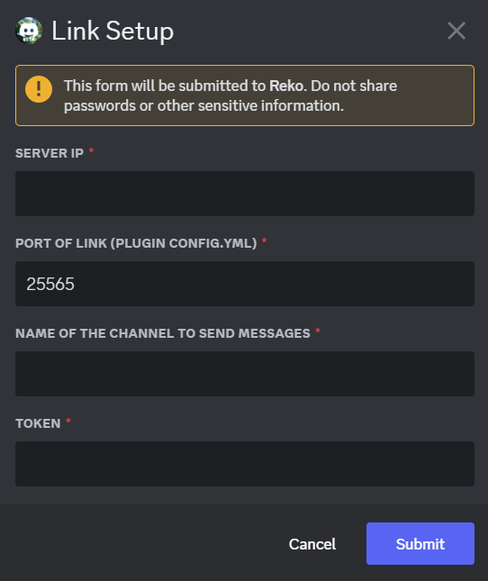

# Reko Link

The all in one integration between your Minecraft Server and your Discord

## What is it

Reko Link is a work in progress feature that allows direct communication from your discord server to your minecraft server using websockets. It **requires the RekoLink plugin** to be installed on your minecraft server. This should allow

- Direct chat between your Minecraft Server and your Discord
- Command execution from your Discord
- Advanced stats
- All with one plugin and one setup command

Reko Link is intended to simplify the confusing process of Discord server integration. Here's a list of whats implemented and what's coming in the future:

- ✅ - Minecraft chat broadcasted to discord
- ✅ - Player joins and leaves broadcasted to discord
- ❌ - Discord chat broadcasted to Minecraft
- ❌ - Command execution from Discord
- ❌ - Full RCON terminal in Discord
- ❌ - Advanced server stats (Need to check what can be acessed with the api, but possibly anything accesible with the spigot api)
- ❌ - Minecraft to Discord account linking
- ❌ - Online player role given to Discord members

## Setup

Reko Link requires a two part setup.
1. Installing and configuring the plugin on your server
2. Connecting Reko to your server

### Installing and configuring Reko Link
> Currently RekoLink is not published on Spigot so latest releases are found on the GitHub

Grab the latest version of RekoLink from [GitHub](https://github.com/TechnoTalksDev/Reko-Link/releases), download the jar file of the plugin. Then place this jar file in the plugins directory of your server. 
> **Please note that RekoLink is only intended to work on Spigot based servers**. Vanilla or modded servers are not supported as of now. 

Restart your server to allow the config.yml to generate. Then navigate to the config.yml. Which should open something simmilar to this.

```yml
# Reko-Link Config! #

#    Connection Settings
#****************************

#This is a PASSWORD make sure it's private
#CHANGE THIS IMMEDIATELY AFTER FIRST INSTALL
token: "Default"

#This port needs to be open like your server port!
#Reko will connect to this port like server-ip:port
#Make sure to port-forward this too!
port: 5050

#     Privacy Settings
#****************************

#Send in game chat to discord
chatToDiscord: true

#Send player join and leave messages to discord
joinLeaveToDiscord: true
```
**Token**: This is the password for the integration. Make it something strong, **you will enter this later** when you setup Reko to connect to your server. 

**Port**: This port needs to be opened just like your Minecraft server port. It can be changed to whatever but remeber this as **you will enter this later** when you setup Reko to connect to your server. 

**Privacy Settings**: Here you can configure what you want sent to your discord with simple `true` or `false` statements. Simply set what you want sent to `true` and what you dont want set to `false`

Save your changes and restart your server in order to let the changes take effect. Your done with configuring Reko Link!

### Connecting Reko to your server

Run `/setup` and select the Reko Link option. You should be presented with something simmilar to this.


**Server IP**: The IP you give to your players to join the server.

**Port of Link**: The port that you set in the config.yml of Reko Link. Note that this port has to be open.

**Name of the channel to send messages**: A channel where Reko can send messages recieved from Reko Link.

**Token**: This is the password that you set in the config.yml of Reko Link.