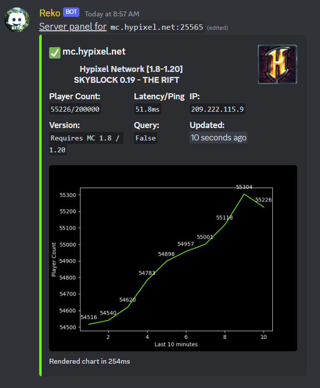
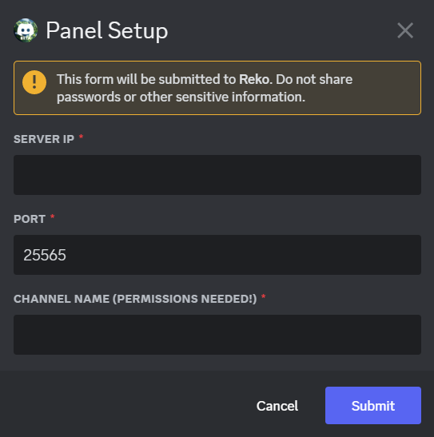

# Server Panel
A simple updating embed to show server stats

## What is it

Reko will update an embed approximately every minute with various server stats like
- Player count
- Latency
- Graph of player count across last 10 minutes

It's meant to be a quick glance status at your server for your discord users without having to run a command

## Setup

To setup this feature run `/setup` command.
You should be prompted for

- Server IP
- Port
- Channel for the panel

**Server IP**: The ip that you would give to your players to join your server

**Port**: The port that your minecraft server is running on (by default this is `25565`)

**Channel**: For the server panel to be sent and updated in your discord server. A few things need to be setup for this channel to work properly with Reko:

- Make sure Reko has permissions to send and edit messages in this channel
- Prevent any other messages from being sent to the channel 
  - Disabling permissions for server members to send messages
  - Preventing other Reko commands from being run in this channel

This channel must be **dedicated to the panel**, other messages may cause problems. 
